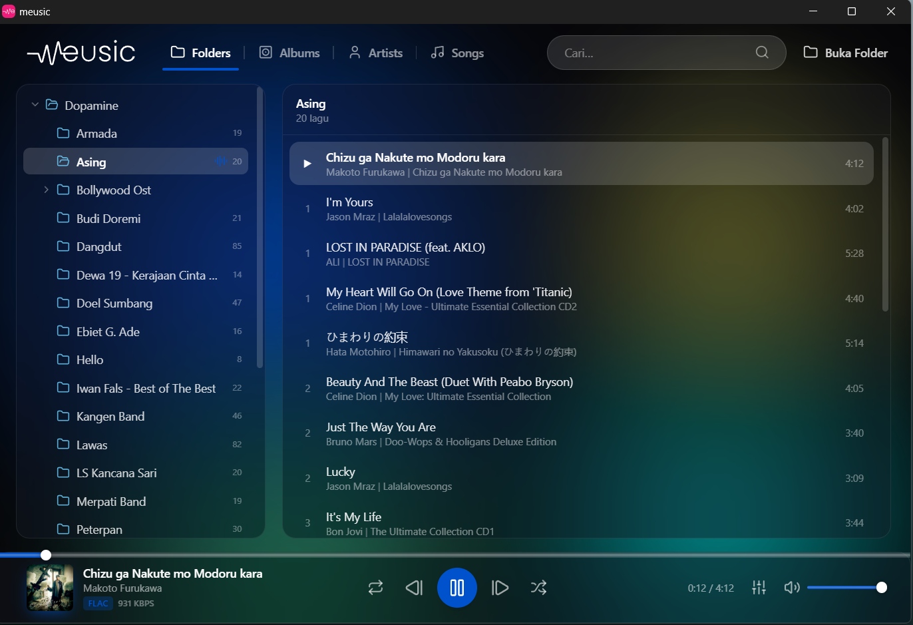
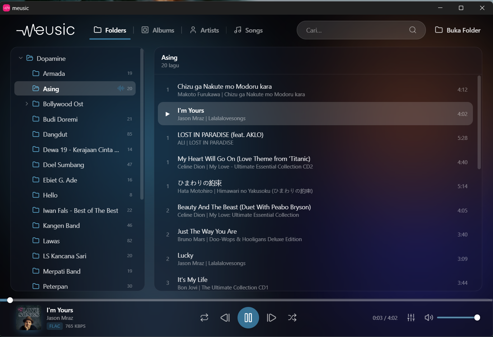
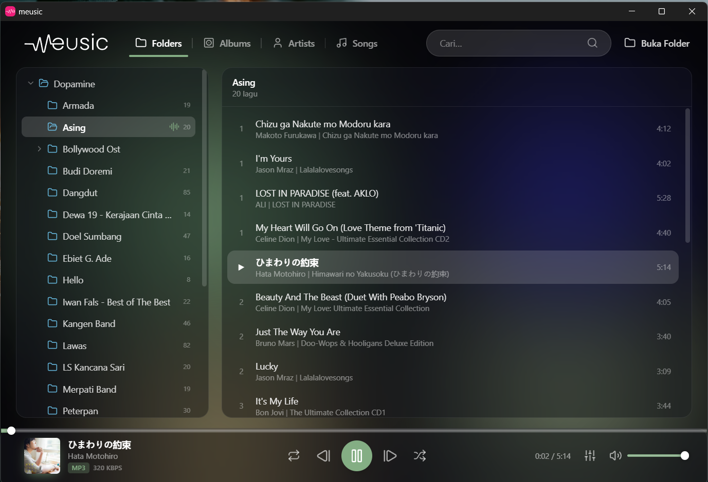
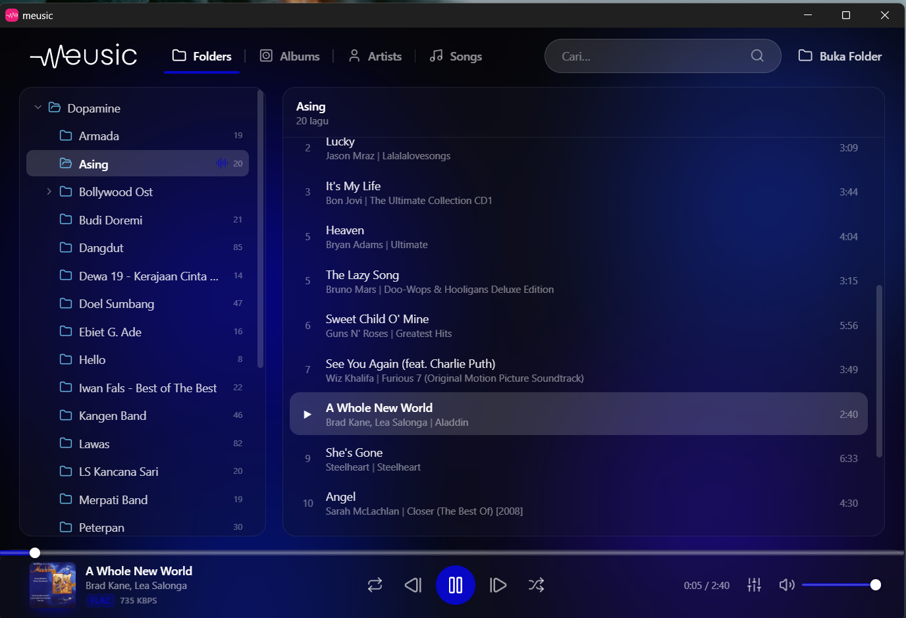

<p align="center">
  
</p>

<p align="center">
  A lightweight, native local music player for Windows<br>
  built with Tauri, React, and Rust.
</p>

<p align="center">
  
  
  
  
  
  
</p>

---

## Overview

**meusic** is a fast, low-footprint desktop player for your local music library. Point it at a
folder and it recursively scans every track inside — including all subfolders — reading tags and
cover art, then lets you browse by folder, album, artist, or song.

The visual identity is **inspired by [Amberol](https://gitlab.gnome.org/World/amberol)**: an
adaptive background whose colors flow from the album art of whatever is playing, with a live
spectrum visualizer. The browsing layout is **inspired by [Dopamine](https://github.com/digimezzo/dopamine-windows)**:
a clean top-bar mode switcher (Folders / Albums / Artists / Songs) with a Windows Explorer–style
folder tree on the left and a track list on the right.

Because it runs on Tauri (a Rust core with the system WebView), it stays light — roughly a quarter
of the memory a comparable Electron player would use, with idle animations paused to keep the CPU
and GPU quiet.

## Screenshots

The background palette is extracted from each track's cover art and transitions smoothly as the
music changes.

<table>
  <tr>
    <td></td>
    <td></td>
    <td></td>
  </tr>
  <tr>
    <td></td>
    <td></td>
    <td></td>
  </tr>
</table>

## Features

- **Recursive folder scanning** — finds every track in a folder and all its subfolders.
- **Wide format support** — MP3, FLAC, M4A / AAC, OGG, Opus, WAV, AIFF, WMA.
- **Adaptive gradient UI** — the background and accent colors are derived from the current
  cover art and cross-fade on track change.
- **Four browsing modes** — Folders (Explorer-style tree), Albums, Artists, and Songs.
- **Cover art** — read from embedded tags, with a fallback to folder images
  (`cover.jpg`, `folder.jpg`, and similar).
- **Now-playing details** — title, artist, album, audio format, and bitrate.
- **Full transport** — play / pause, next / previous, seek, volume, shuffle, and repeat
  (off / all / one).
- **6-band equalizer** with presets (Flat, Bass, Vocal, Treble).
- **Spectrum visualizer** powered by the Web Audio API.
- **Global search** across title, artist, and album.
- **Responsive chrome** — the top and bottom bars collapse to icons on narrow windows.
- **Power-aware** — animations pause when nothing is playing or the window is in the background.

## Tech Stack

| Layer    | Technology                          | Responsibility                                            |
| -------- | ----------------------------------- | --------------------------------------------------------- |
| Backend  | Rust (`lofty`, `walkdir`, `rayon`)  | Recursive scan, tag and cover-art extraction (parallel)   |
| Bridge   | Tauri 2 commands                    | `scan_folder`, `get_cover`; asset protocol for playback   |
| Frontend | React + TypeScript + Vite + Tailwind | User interface and state                                  |
| Audio    | Web Audio API                       | Playback, 6-band equalizer, analyser for the visualizer   |

## Getting Started

### Prerequisites

- [Rust](https://www.rust-lang.org/tools/install) (stable)
- [Node.js](https://nodejs.org/) 18 or newer
- [pnpm](https://pnpm.io/installation)
- WebView2 runtime (preinstalled on Windows 11)

### Development

```bash
pnpm install
pnpm tauri dev
```

### Build

```bash
pnpm tauri build
```

The installer is produced under `src-tauri/target/release/bundle/`.

## Project Structure

```
src/
  audio/engine.ts        Web Audio graph (equalizer + analyser), singleton
  hooks/usePlayer.ts     Playback state and queue
  lib/                   api.ts (Tauri calls), colors.ts (palette), views.ts (tree/groups)
  components/            TopBar, FolderTree, GroupList, Library, BottomBar,
                         NowPlayingOverlay, GradientBackground, Visualizer, Equalizer
  App.tsx                Composition and view orchestration
src-tauri/
  src/lib.rs             scan_folder + get_cover commands
  tauri.conf.json        window and asset-protocol configuration
```

## Acknowledgments

- **UI inspired by [Amberol](https://gitlab.gnome.org/World/amberol)** — the adaptive,
  cover-art-reactive background and visualizer.
- **Layout inspired by [Dopamine](https://github.com/digimezzo/dopamine-windows)** — the
  Folders / Albums / Artists / Songs browsing model.

These projects are independent works under their own licenses; meusic shares none of their code
and only draws on them as design inspiration.

## License

Released under the [MIT License](LICENSE).
